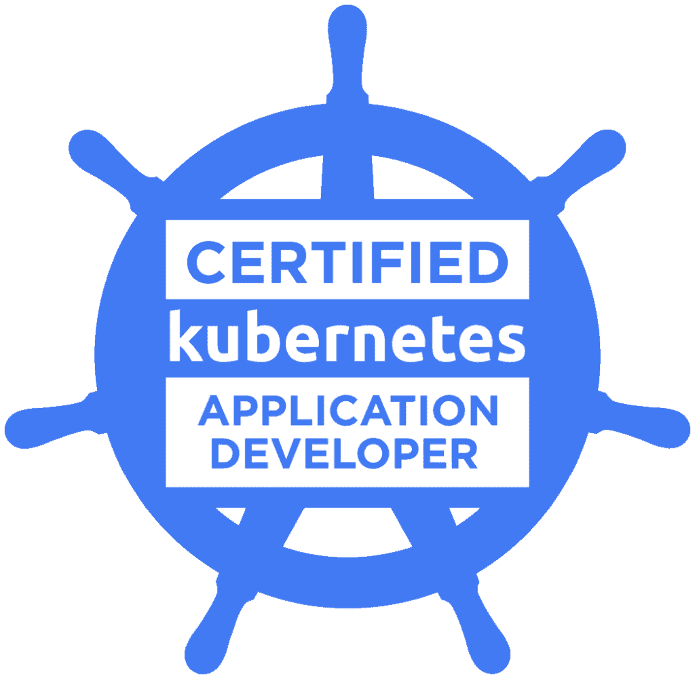

## Syed Muhammad Hashim { .md }

## About Me
As a passionate Software Developer and DevOps Engineer, I have worked extensively with startups and am well-equipped to handle multitasking and pressure. 

Programming Languages: I am language agnostic and proficient in Python, Golang, Java, and JavaScript, with a stronger grasp on the first two.

Operating Systems: I have experience working with Linux and MacOS but can also work with Windows if needed.

Software and Tools: I'm comfortable working with Microservices and Distributed Systems. My technical knowledge extends to a variety of software and tools, including Docker, Kubernetes, AWS, Terraform, Ansible, Helm, Prometheus, Grafana, ArgoCd, and more.

Collaborative Approach: As a team player, I value communication and actively seek feedback and reviews. I participate eagerly in team discussions and am not afraid to raise questions when appropriate. I pride myself on being available when needed and always willing to help others.

Work Ethic: My work style is characterized by a strong attention to detail, and I strive to ensure that every task is completed to the best of my abilities. I am someone who enjoys the software development process and is passionate about continuing to do so.

Career Goals: In the future, my career goals include becoming a leading software developer and continuously expanding my technical and interpersonal skills.

<!-- ## Key Technical Skills 

## Certifications

Certified Kubernetes Application Developer: I have completed my Kubernetes CKAD certification. This covered the skills and knowledge required to design, build, configure, and expose cloud-native applications using Kubernetes.

## Employment History -->